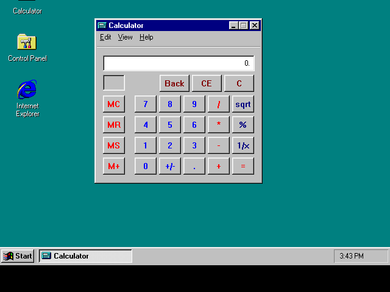
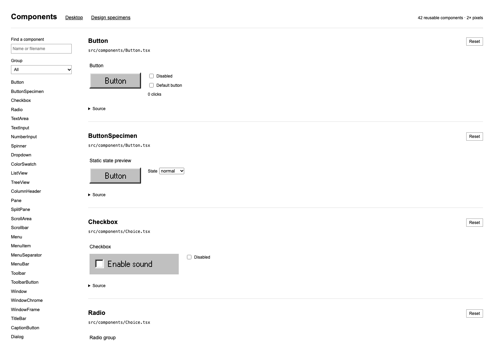
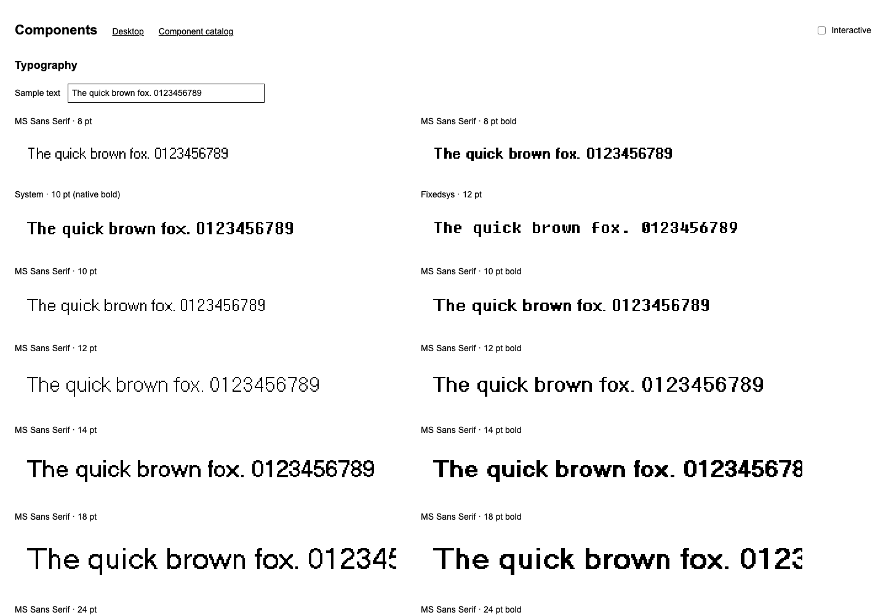

# Win95 UI

Pixel-accurate Windows 95 components for React.

## Use

```tsx
import { Button, Icon, WindowFrame } from '@ethandenny/win95-ui'
import '@ethandenny/win95-ui/styles.css'
```

The package owns its fonts, icons, choice glyphs, and cursor artwork. Consumers do
not need to copy files into `public`.

## Development

```sh
npm install
npm test
npm run build
npm run dev
```

The specimen site opens the component catalog at `/`, with the design sheet at
`/design` and the desktop recreation at `/desktop`.

The package is currently distributed to Chat95 as a versioned `npm pack`
artifact because both repositories are private. Update the package version, run
`npm pack`, and replace Chat95's pinned tarball when releasing a change.

## Screenshots

### Desktop recreation



### Component catalog



### Design specimens


